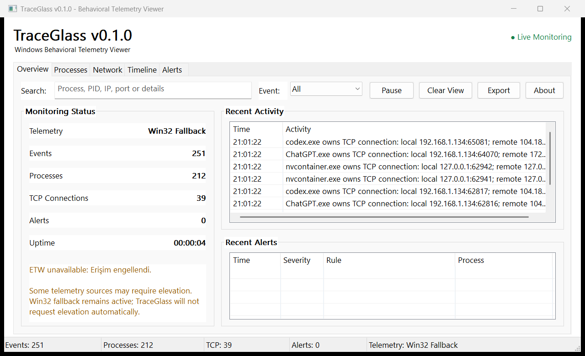
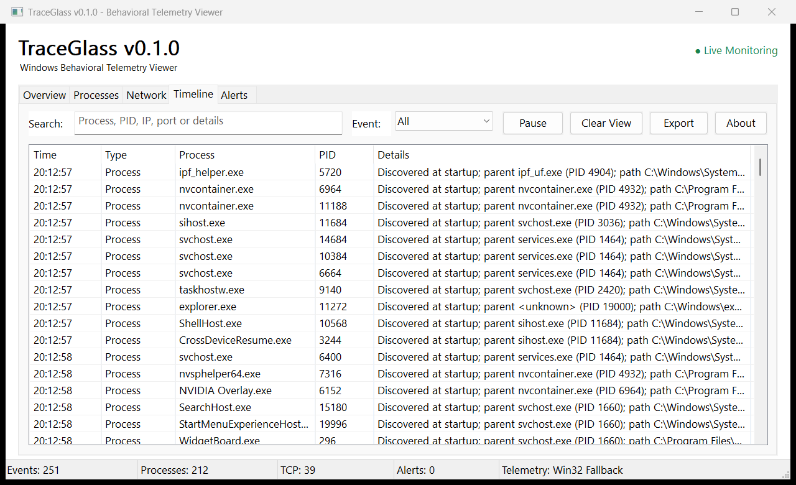
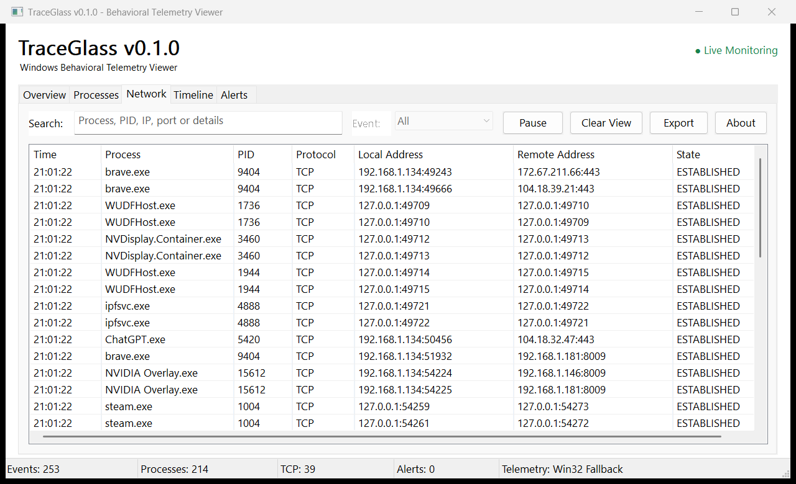

# TraceGlass

TraceGlass is a lightweight native Windows behavioral telemetry viewer
written in C using Win32 APIs and Event Tracing for Windows.



## Overview

TraceGlass presents process and IPv4 TCP activity as a parent-child process
tree, searchable timeline, network table, and small set of behavioral alerts.
It is intended for system observation, malware-analysis labs, and DFIR work on
systems the operator is authorized to inspect.

The application attempts a private process ETW session and clearly reports
whether it is using **ETW** or **Win32 Fallback** telemetry. Toolhelp snapshot
reconciliation remains enabled in both modes. TraceGlass does not request
elevation automatically and does not change the events or processes it observes.

## Features

- Process start/stop monitoring
- Parent-child process correlation
- TCP connection visibility
- Real-time event timeline
- Lightweight behavioral alerts
- JSON/CSV/TXT export
- Native Win32 interface

Additional usability features include an Overview dashboard, debounced search,
event-type filtering, sortable tables, render-only Pause/Resume, per-view Clear,
event detail windows, and copy-only context menus.

## Screenshots

| Overview | Timeline | Network |
| --- | --- | --- |
| [](screenshots/traceglass-overview.png) | [](screenshots/traceglass-timeline.png) | [](screenshots/traceglass-network.png) |

These images were captured from the running v0.1.0 Win32 application in Win32
Fallback mode.

## Architecture

```text
Windows
   |
   | ETW / Win32
   v
Telemetry Engine
   |
   v
Event Queue
   |
   +----> Correlation / Event Store
   |
   +----> Detection Engine
   |
   v
Native Win32 GUI
```

Telemetry workers copy complete event values into a critical-section-protected
queue. A coalesced `WM_APP` notification wakes the GUI thread, which owns the
event store and every common control. Process identity uses PID plus process
creation time where Windows permits it, reducing PID-reuse ambiguity.

See [docs/architecture.md](docs/architecture.md) for component ownership,
threading, correlation, telemetry-mode, shutdown, and performance details.

## Telemetry Sources

| Data | Source | Behavior |
| --- | --- | --- |
| Process start/stop | `Microsoft-Windows-Kernel-Process` ETW | Optional real-time source; may require elevation or policy access |
| Process reconciliation | Toolhelp process snapshots | Always active; one-second polling interval |
| Creation time | `GetProcessTimes` | Used with PID for correlation when accessible |
| Executable path | `QueryFullProcessImageNameW` | May be unavailable for protected processes |
| IPv4 TCP | `GetExtendedTcpTable(TCP_TABLE_OWNER_PID_ALL)` | Emits newly observed `ESTABLISHED` rows with owning PID |

Network polling identifies that a process owns an established TCP row. It does
not reliably establish connection direction, so TraceGlass does not label these
rows as outbound or inbound.

## Build

### Requirements

- Windows 10 or Windows 11 x64
- CMake 3.20 or newer
- MSVC with the Desktop development with C++ workload and a Windows SDK
- Optional: a recent x64 MinGW-w64 distribution with ETW/TDH headers and import
  libraries

From an x64 Native Tools Command Prompt for Visual Studio:

```bat
mkdir build
cd build
cmake ..
cmake --build . --config Release
```

The application is written to `build\Release\TraceGlass.exe` with the default
Visual Studio generator.

Equivalent out-of-source commands are:

```bat
cmake -S . -B build
cmake --build build --config Release
ctest --test-dir build -C Release --output-on-failure
```

The CTest smoke test writes and validates JSON, CSV, and TXT exports. MSVC is the
tested release toolchain. MinGW support is best-effort because header and import
library coverage differs between distributions.

## Usage

1. Start `TraceGlass.exe`. The `asInvoker` manifest does not request elevation.
2. Confirm the **Telemetry** value in Overview or the status bar. If ETW is not
   available, the displayed Windows reason explains that Win32 Fallback remains
   active.
3. Use **Processes** for process-only parent-child relationships, **Network** for
   established IPv4 TCP rows, and **Timeline** for chronological events.
4. Search by process name, PID, IP address, port, path, rule, or detail text. The
   Event selector narrows Timeline/Overview to All, Process, Network, or Alert.
5. Click a table header to sort. Double-click a row for complete event details,
   or right-click to copy available fields.
6. **Pause** stops table rendering only; collection and storage continue. Resume
   renders buffered events. **Clear View** clears only the selected event view;
   it does not reset telemetry or delete stored session events.
7. **Export** writes all collected session events through the native Save As
   dialog. Application diagnostics remain separate in `logs\traceglass.log`.

## Detection Rules

The v0.1.0 rules are local, hard-coded context signals:

| Severity | Rule |
| --- | --- |
| MEDIUM | Office application spawned a known script interpreter |
| MEDIUM | Executable path is under a user or Windows temporary directory |
| INFO | Script interpreter owns a newly observed established TCP connection |

Alerts are not proof of malicious behavior and require analyst review. No rule
blocks, kills, injects into, or otherwise modifies a process.

## Export Formats

The native Save As dialog supports UTF-8 JSON, CSV, and TXT. JSON records retain
at least:

```json
{
  "timestamp": "2026-08-27T19:24:12.123",
  "event_type": "network_connection",
  "process_name": "powershell.exe",
  "pid": 4820,
  "parent_pid": 1204,
  "details": "Established TCP connection; local ...; remote ..."
}
```

Network state/endpoints and alert severity/rule fields are also exported when
present. Export always uses the complete in-memory session, independent of the
current search filter or Clear View threshold.

## Limitations

- ETW session/provider access can require elevated privileges or be restricted
  by local policy. TraceGlass continues with Win32 Fallback instead of failing.
- Fallback process telemetry is limited by the one-second Toolhelp polling
  interval; a process that starts and exits between snapshots may be missed.
- Network visibility is polling, not packet capture. Short-lived connections can
  be missed, and no payload, byte count, DNS, or decryption data is collected.
- TCP direction cannot be inferred reliably from every IP Helper row. Displayed
  local/remote endpoints do not imply outbound or inbound initiation.
- v0.1.0 covers established IPv4 TCP only; UDP, IPv6, and connection-close events
  are not collected.
- File and registry event types are reserved in the shared model, but their
  collectors are not part of this release.
- The event store grows in memory for the session. Pause and Clear View do not
  discard evidence; a configurable retention policy is not yet implemented.
- Protected-process rules can prevent executable path and creation-time access,
  including on elevated sessions.
- TraceGlass is not antivirus or EDR software, and its detection rules are
  intentionally simple.
- Windows 10/11 x64 is the supported target.

## Roadmap

- **v0.2:** focused ETW file create/write/delete visibility
- **v0.3:** read-only registry change visibility for selected high-value paths
- **v0.4:** cross-domain process/file/network/registry correlation
- **v0.5:** configurable retention and richer filter composition
- **v1.0:** stabilized collectors, search, filtering, export, tree, timeline, and
  alert behavior under long-running workloads

No packet sniffer, kernel driver, injection, credential scanner, cloud backend,
or automated remediation is planned for the small native utility scope.

## Security

TraceGlass requests `PROCESS_QUERY_LIMITED_INFORMATION` only and uses documented
ETW, Toolhelp, IP Helper, and Win32 APIs. It contains no persistence, process
injection, credential access, security-control bypass, exploit, or process-kill
feature.

See [SECURITY.md](SECURITY.md) for supported versions and vulnerability-reporting
guidance.

## Disclaimer

Use TraceGlass only on systems you own or are authorized to analyze. Telemetry
can be incomplete, and heuristic alerts require human validation. The project
provides observation and export, not prevention or remediation.

## License

TraceGlass is distributed under the existing [MIT License](LICENSE).
